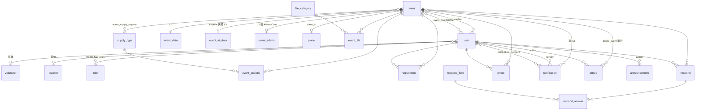

# 03. 資料模型

所有資料表都有 `id`、`created_at`、`updated_at`；下面不重複列。
需要軟刪除的表（`event`、`user`、`article`、`photo`）另加 `deleted_at`。

所有 `datetime` 欄位用 Laravel 的 `timestamp()`（PG 的 `timestamp without time zone`），**一律存 UTC**，
顯示時才轉 `Asia/Taipei`，見 [06-tech-stack.md](06-tech-stack.md) 的「時區」。

## ER 圖

## 主要資料表

### event 活動

活動的最小識別單位。細節拆到 `event_data`，管理資訊拆到 `event_admin`，
是為了讓權限控制與 Airtable 同步範圍都可以整表切割。

| 欄位 | 型別 | 說明 |
| --- | --- | --- |
| `name` | string | 活動名稱（顯示名稱） |
| `description` | text | 活動描述 |
| `created_by` | FK user | 建立者 |

### event_data 活動資料

| 欄位 | 型別 | 說明 |
| --- | --- | --- |
| `event_id` | FK event, unique | 一對一 |
| `start_at` | datetime | 開始時間 |
| `end_at` | datetime, nullable | 結束時間 |
| `place_id` | FK place, nullable | 地點（縣市一律從 `place.city` join 取得，本表不存 `city`） |
| `topic` | string, nullable | 課程主題（放主題、投影片標題） |
| `event_type` | string | 活動性質（選項可由管理員增加） |
| `audience_type` | string, nullable | 聽眾類型（選項待討論） |
| `capacity` | int, nullable | 志工需求數（總召填寫，系統自有欄位） |
| `expected_attendees` | int, nullable | 預計學員人數（系統自有欄位） |
| `registration_deadline` | datetime, nullable | 報名截止 |
| `participant_count` | int, nullable | 實際參與人數（已定案放這裡，不改記為 `event_statistic`） |
| `calendar_url` | string, nullable | Google Calendar 連結 |
| `note` | text, nullable | 備註（聯絡資訊、需求、特殊狀況；來自 Airtable） |
| `volunteer_note` | text, nullable | 給志工看的備註（系統自有欄位，會呈現在志工系統） |
| `status` | enum | `draft` / `open` / `closed` / `done` / `cancelled` |
| `airtable_record_id` | string, nullable, unique | Airtable 來源 record |
| `synced_at` | datetime, nullable | 最後同步時間 |
| `created_by` | FK user | |

`event_type` 與 `audience_type` 的選項清單：**待確認**，先以字串儲存，選項由設定檔或後台維護。

### event_at_data 活動匯入資料

Airtable 原始快照，唯讀，一對一。用途是保留原始 payload 以便日後重新對應欄位或除錯，不直接給前台使用。

| 欄位 | 型別 | 說明 |
| --- | --- | --- |
| `event_id` | FK event, unique | |
| `airtable_record_id` | string, unique | |
| `payload` | json | Airtable record 的完整 fields |
| `synced_at` | datetime | |

### event_admin 活動管理

一對一，只有 Admin / Core 可見。

| 欄位 | 型別 | 說明 |
| --- | --- | --- |
| `event_id` | FK event, unique | |
| `is_internal_only` | bool | 僅限特定志工可看（原 Airtable「只上內部行事曆」） |
| `negotiation_status` | enum | 洽談進度，選項見 [04-airtable-sync.md](04-airtable-sync.md) |
| `unit_fee` | decimal, nullable | 單位提供講師費 |
| `unit_payment_method` | string, nullable | 單位付款方式 |
| `assoc_paid_amount` | decimal, nullable | 協會支付金額 |
| `fee_status` | string, nullable | 講師費目前進度（含「已給協會」等選項） |
| `fee_note` | text, nullable | 講師費備註 |
| `admin_note` | text, nullable | 管理備註 |

### place 地點

Airtable 的「地點」是純文字，匯入時要對應或新建。

| 欄位 | 型別 | 說明 |
| --- | --- | --- |
| `name` | string | 顯示地點 |
| `address` | string, nullable | |
| `city` | string, nullable | 縣市 |
| `map_url` | string, nullable | |
| `note` | text, nullable | |

### user 使用者

| 欄位 | 型別 | 說明 |
| --- | --- | --- |
| `name` | string | 顯示名稱。沿用 Laravel 預設的 `name` 欄位，不改名成 `display_name`，以免與 starter kit 的 factory、註冊表單脫節 |
| `real_name` | string, nullable | 本名，只在管理頁顯示 |
| `email` | string, unique | |
| `password` | string, nullable | OAuth 登入者可為空 |
| `avatar` | string, nullable | |
| `oauth_provider` | string, nullable | |
| `oauth_id` | string, nullable | |
| `status` | enum | `pending` / `active` / `suspended` |
| `airtable_record_id` | string, nullable | 對應 Airtable 講師表 |
| `last_login_at` | datetime, nullable | |

身分證、匯款資料**不放這裡**，也不放系統任何地方。

### volunteer 志工資料

使用者的延伸，只放志工聯絡用的資料。

| 欄位 | 型別 | 說明 |
| --- | --- | --- |
| `user_id` | FK user, unique | |
| `name` | string | |
| `phone` | string, nullable | |
| `line_id` | string, nullable | |

### teacher 講師簡介

講師身分靠角色 `lecturer`，講師與活動的關係靠 `event_teacher`。這張表只放簡介，**P0 一併建立**（欄位少、成本低），Model 與頁面之後再說。

| 欄位 | 型別 | 說明 |
| --- | --- | --- |
| `user_id` | FK user, unique | |
| `title` | string, nullable | 頭銜 |
| `bio` | text, nullable | 經歷介紹 |

### registration 報名

`(event_id, user_id)` 唯一。

| 欄位 | 型別 | 說明 |
| --- | --- | --- |
| `event_id` | FK event | |
| `user_id` | FK user | |
| `status` | enum | `registered` / `cancelled` / `attended` / `no_show` / `waitlist` |
| `registered_at` | datetime | |
| `cancelled_at` | datetime, nullable | |
| `checked_in_at` | datetime, nullable | |
| `note` | text, nullable | |

### respond 活動回饋

`(event_id, user_id)` 唯一；內容在 `respond_answer`。

| 欄位 | 型別 | 說明 |
| --- | --- | --- |
| `event_id` | FK event | |
| `user_id` | FK user | 填寫人 |
| `status` | enum | `draft` / `submitted` |
| `submitted_at` | datetime, nullable | |

### event_statistic 活動統計

「回報成果數」寫這裡，`(event_id, supply_type_id)` 唯一。

| 欄位 | 型別 | 說明 |
| --- | --- | --- |
| `event_id` | FK event | |
| `supply_type_id` | FK supply_type | 統計的項目 |
| `count` | int | |
| `note` | text, nullable | |
| `reported_by` | FK user | |
| `reported_at` | datetime | |

### event_file 活動檔案

| 欄位 | 型別 | 說明 |
| --- | --- | --- |
| `event_id` | FK event | |
| `file_category_id` | FK file_category | |
| `original_name` | string | |
| `path` | string | |
| `mime` | string | |
| `size` | int | bytes |
| `uploaded_by` | FK user | |

### photo 照片

| 欄位 | 型別 | 說明 |
| --- | --- | --- |
| `event_id` | FK event | |
| `user_id` | FK user | 上傳者 |
| `path` | string | |
| `caption` | string, nullable | |
| `taken_at` | datetime, nullable | |
| `sort` | int | |
| `is_public` | bool | |

### notification 通知

接收者在 `notification_recipient`。

| 欄位 | 型別 | 說明 |
| --- | --- | --- |
| `event_id` | FK event, nullable | 活動通知才有 |
| `sender_id` | FK user | |
| `title` | string | |
| `body` | text | |
| `channel` | enum | `email` / `line` / `site` |
| `status` | enum | `draft` / `scheduled` / `sent` / `failed` |
| `scheduled_at` | datetime, nullable | |
| `sent_at` | datetime, nullable | |

### role 角色

**直接用 `spatie/laravel-permission` 發佈的 `roles` 表，不自建、不加欄位。**

| 欄位 | 型別 | 說明 |
| --- | --- | --- |
| `name` | string | 存 slug：`admin` / `core` / `coordinator` / `lecturer` / `volunteer` / `marketer` |
| `guard_name` | string | 套件欄位，固定 `web` |

中文顯示名稱與說明放語系檔（`lang/zh_TW/roles.php`），不進資料庫；要改中文顯示不必動 schema。

### article 行銷文章

| 欄位 | 型別 | 說明 |
| --- | --- | --- |
| `author_id` | FK user | |
| `title` | string | |
| `slug` | string, unique | |
| `body` | longtext | |
| `cover_path` | string, nullable | |
| `status` | enum | `draft` / `published` |
| `published_at` | datetime, nullable | |

### announcement 公佈欄

| 欄位 | 型別 | 說明 |
| --- | --- | --- |
| `author_id` | FK user | |
| `title` | string | |
| `body` | text | |
| `is_pinned` | bool | |
| `visible_role` | string, nullable | 限定哪個角色可見，null 表示所有登入者 |
| `published_at` | datetime, nullable | |

## 設定／類別表

### supply_type 物資／統計類型

同時服務「物資需求」與「成果統計」，取代原本分開的 statistic_category。

| 欄位 | 型別 | 說明 |
| --- | --- | --- |
| `name` | string | |
| `unit` | string, nullable | 單位（份、本、人） |
| `can_request` | bool | 是否可發出物資需求 |
| `show_in_report` | bool | 是否列在回報數 |
| `is_counted` | bool | 是否納入統計 |
| `sort` | int | |
| `is_active` | bool | |

### respond_field 回饋題目

「管理有哪些回饋欄位」編輯這張表。

| 欄位 | 型別 | 說明 |
| --- | --- | --- |
| `label` | string | |
| `field_type` | enum | `text` / `textarea` / `number` / `select` / `rating` |
| `options` | json, nullable | select 的選項 |
| `is_required` | bool | |
| `sort` | int | |
| `is_active` | bool | |

### file_category 檔案類別

| 欄位 | 型別 | 說明 |
| --- | --- | --- |
| `name` | string | |
| `sort` | int | |

### 初始資料（seeder）

| 表 | 初始項目 |
| --- | --- |
| `roles` | `admin`、`core`、`coordinator`、`lecturer`、`volunteer`、`marketer` |
| `supply_types` | 扇子、肥皂、傳單 |
| `respond_fields` | **待提供** |
| `file_categories` | **待提供** |

`supply_types` 的單位與三個旗標（`can_request` / `show_in_report` / `is_counted`）尚未指定，見待確認事項。
seeder 一律寫成冪等（`upsert`），重跑不會產生重複資料。

## 關聯表

| 表 | 連結 | 額外欄位 | 說明 |
| --- | --- | --- | --- |
| `model_has_roles` | user ↔ role | — | 由 spatie/laravel-permission 提供 |
| `event_teacher` | event ↔ user | `is_payee`（領款的講師）、`fee_amount`、`fee_status`、`fee_note`、`submitted_at` | 對應 Airtable「講師」+「領款的講師」；講師回報頁寫這裡 |
| `event_coordinator` | event ↔ user | `assigned_at` | 「我負責的場次」。**一個活動可以有多位總召**，所以維持關聯表，不簡化成 `event.coordinator_id` |
| `notification_recipient` | notification ↔ user | `delivered_at`、`read_at`、`error` | |
| `event_supply_request` | event ↔ supply_type | `quantity`、`note`、`requested_by`、`status`（`requested` / `approved` / `fulfilled`） | 「提出物資需求」 |
| `respond_answer` | respond ↔ respond_field | `value` | `(respond_id, respond_field_id)` 唯一 |
| `article_event` | article ↔ event | — | 選用，文章要連回活動時才需要 |

## 狀態列舉一覽

| 表.欄位 | 值 |
| --- | --- |
| `event_data.status` | `draft` / `open` / `closed` / `done` / `cancelled` |
| `event_admin.negotiation_status` | 見 [04-airtable-sync.md](04-airtable-sync.md) |
| `user.status` | `pending` / `active` / `suspended` |
| `registration.status` | `registered` / `cancelled` / `attended` / `no_show` / `waitlist` |
| `respond.status` | `draft` / `submitted` |
| `notification.status` | `draft` / `scheduled` / `sent` / `failed` |
| `notification.channel` | `email` / `line` / `site` |
| `article.status` | `draft` / `published` |
| `event_supply_request.status` | `requested` / `approved` / `fulfilled` |
| `respond_field.field_type` | `text` / `textarea` / `number` / `select` / `rating` |

在 Laravel 內以 PHP enum 實作，資料庫欄位用 string 而非 PostgreSQL 原生 enum type，方便日後加值不必改 schema。

## Migration 分組建議

對應 issue #4「不同模組分拆在不同 migration 檔案」：

| 檔案（依序） | 內容 |
| --- | --- |
| `create_users_module` | `users`、`volunteers`、`teachers` |
| `create_roles_module` | spatie 套件的 migration |
| `create_places_table` | `places` |
| `create_events_module` | `events`、`event_data`、`event_at_data`、`event_admin` |
| `create_event_relations` | `event_teacher`、`event_coordinator` |
| `create_registrations_table` | `registrations` |
| `create_lookup_tables` | `supply_types`、`respond_fields`、`file_categories` |
| `create_report_module` | `responds`、`respond_answers`、`event_statistics`、`photos`、`event_files` |
| `create_supply_module` | `event_supply_requests` |
| `create_notifications_module` | `notifications`、`notification_recipients` |
| `create_announcements_table` | `announcements` |
| `create_articles_module` | `articles`、`article_event` |

表名依 Laravel 慣例用複數，關聯表用單數字母排序（`event_teacher`）。

## 待確認事項

- `respond_field`（回饋題目）的初始題目清單。
- `file_category`（檔案類別）的初始項目清單。
- `supply_type` 三個初始項目的單位，以及 `can_request` / `show_in_report` / `is_counted` 三個旗標各自要開哪些。
- `fee_status` 出現在兩處：`event_admin.fee_status` 與 `event_teacher.fee_status`。前者理解為「單位付給協會」的進度、後者為「協會付給個別講師」的進度，語意待確認，以免兩邊資料打架。
- `event_type`、`audience_type` 的選項清單（見上方 `event_data` 說明）。

### 已定案（原待確認）

- `participant_count` 放 `event_data`，不改記為 `event_statistic`。
- `teacher` 表 P0 一併建立。
- 一個活動可以有多位總召，`event_coordinator` 維持關聯表。
- `city` 只留 `place.city`，`event_data` 不存。
- `users` 沿用 Laravel 預設的 `name` 欄位當顯示名稱，另加 `real_name`。
- 角色用 spatie 原生 `roles` 表（`name` + `guard_name`），中文名放語系檔。
