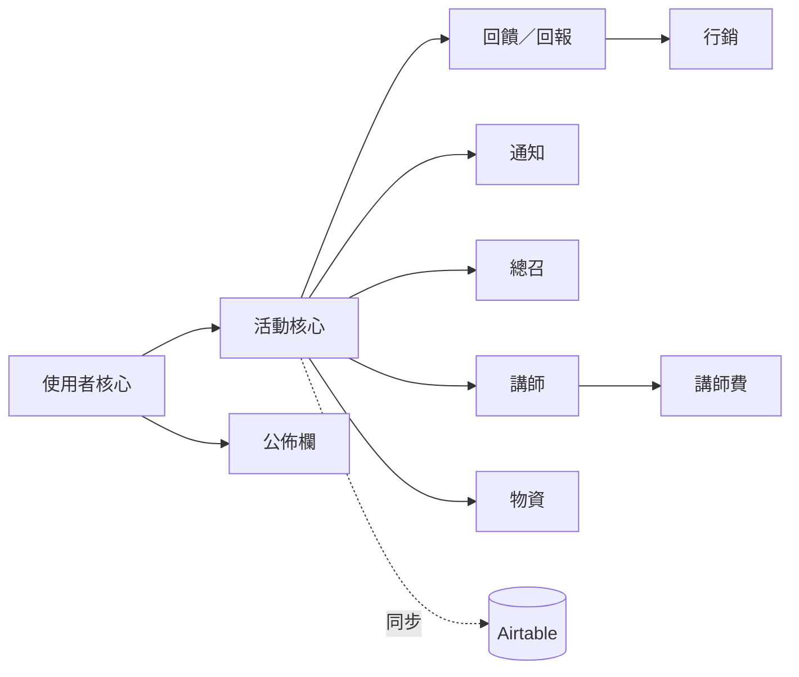

# 05. 功能模組

每個模組列出：功能、相依模組、主要資料表、對應頁面。
權限細節見 [02-roles-and-permissions.md](02-roles-and-permissions.md)，欄位細節見 [03-data-model.md](03-data-model.md)。

## 模組相依圖

## 使用者核心模組

- **功能**：註冊／登入（Email + 密碼、OAuth）、個人資料、志工聯絡資料、角色指派、使用者列表、使用者與權限列表。
- **相依**：無。
- **資料表**：`users`、`volunteers`、`teachers`、`roles`、`model_has_roles`。
- **頁面**：登入、個人資料、後台「使用者列表」、後台「使用者與權限列表」。
- **備註**：新使用者 `status = pending`，由 Admin / Core 審核成 `active`（**待確認**：是否需要審核）。

## 活動核心模組

- **功能**：從 Airtable 匯入活動、近期活動（清單、卡片、行事曆三種呈現）、活動篩選、活動詳情、志工報名／取消、我的活動、最近統計數字、查看志工組成、瀏覽／匯出志工名單、編輯活動（系統自有欄位）、匯出活動。
- **相依**：使用者核心、Airtable 同步。
- **資料表**：`events`、`event_data`、`event_at_data`、`event_admin`、`places`、`registrations`、`event_files`、`file_categories`。
- **頁面**：首頁、登入首頁、近期活動、活動詳情、活動詳情編輯、我的活動頁。
- **關鍵規則**：
  - 志工只看到 `negotiation_status = confirmed` 且 `is_internal_only = false` 的活動。
  - 報名 `(event, user)` 唯一；取消是改 `status = cancelled` 並記 `cancelled_at`，不刪列。
  - 達到 `capacity` 之後的報名進 `waitlist`（**待確認**：是否要候補機制）。
  - 「最近統計數字」P0 可寫死公式（例如 900 場歷史 + 系統內 `done` 場次數）。

## Airtable 同步模組

- **功能**：排程或手動同步 Airtable 活動與講師資料。
- **相依**：活動核心。
- **資料表**：`event_at_data`，並寫入活動核心的表。
- **介面**：artisan 指令 + scheduler；無前台頁面。後台可顯示上次同步時間（**待確認**）。
- 細節見 [04-airtable-sync.md](04-airtable-sync.md)。

## 回饋／回報模組

- **功能**：寫／編輯回饋、上傳照片、回報成果數、瀏覽回饋與照片、管理回饋欄位。
- **相依**：活動核心。
- **資料表**：`responds`、`respond_answers`、`respond_fields`、`photos`、`event_statistics`、`supply_types`。
- **頁面**：回饋填寫頁、照片上傳頁、成果回報頁、瀏覽成果頁、後台「管理有哪些回饋欄位」。
- **關鍵規則**：
  - 回饋表單題目由 `respond_fields` 動態決定，志工填寫時只顯示 `is_active` 的題目。
  - 每人每活動一份回饋；`draft` 可再改，`submitted` 後是否可改**待確認**。
  - 成果數依 `supply_types.show_in_report = true` 的項目列出給志工填。
  - KPI 統計只計 `supply_types.is_counted = true` 的項目。

## 通知模組

- **功能**：總召發活動修正通知，自動通知所有報名志工；後台查看通知列表。
- **相依**：活動核心。
- **資料表**：`notifications`、`notification_recipients`。
- **頁面**：活動詳情「發佈更新」（P2）、後台「查看通知列表」。
- **關鍵規則**：
  - 建立活動通知時，接收者自動填入該活動 `status = registered` 的報名者。
  - `channel` P0 只做 `site`（站內），`email` / `line` 後續。
  - 用 queue 發送，逐筆記錄 `delivered_at` / `error`。

## 公佈欄模組

- **功能**：登入後首頁顯示公告，可置頂、可限定角色可見。
- **相依**：使用者核心。
- **資料表**：`announcements`。
- **頁面**：首頁「公佈欄」；管理端在後台（**待確認**：矩陣沒列公告的編輯權限，暫定 Admin / Core）。

## 總召模組

- **功能**：活動指派總召、我負責的場次、總召對自己場次的編輯／通知／物資權限。
- **相依**：活動核心。
- **資料表**：`event_coordinator`。
- **頁面**：我負責的場次；活動詳情／編輯頁依總召身分開放功能。
- **關鍵規則**：權限檢查是「有 `coordinator` 角色 **且** `event_coordinator` 有這筆活動」。

## 講師模組

- **功能**：活動指派講師（來自 Airtable）、講師查看自己場次、講師回報講師費狀況。
- **相依**：活動核心。
- **資料表**：`event_teacher`、`teachers`。
- **頁面**：講師回報頁、我負責的場次（講師視角）。

## 講師費模組

- **功能**：追蹤每場活動的單位講師費、協會支付金額、付款進度、領款講師。
- **相依**：活動核心、講師模組。
- **資料表**：`event_admin`（單位層級）、`event_teacher`（講師層級：`is_payee`、`fee_amount`、`fee_status`）。
- **頁面**：活動詳情編輯（Admin / Core 區塊）、講師回報頁。
- **關鍵規則**：所有金額欄位只有 Admin / Core 可見；講師只看到並更新自己在 `event_teacher` 的那一列。

## 物資模組

- **功能**：物資類型管理、總召對活動提出物資需求、需求狀態追蹤。
- **相依**：活動核心。
- **資料表**：`supply_types`、`event_supply_requests`。
- **頁面**：活動詳情「提出物資需求」、後台「列出物資類型」、後台「編輯物資」。
- **關鍵規則**：
  - 只有 `supply_types.can_request = true` 的項目可以提需求。
  - Core 明確**不能**提物資需求（矩陣標 x），只有 Admin 與該場總召能提。
  - 需求狀態 `requested → approved → fulfilled`，由 Admin / Core 推進。

## 行銷模組

- **功能**：列出、新增／編輯、刪除行銷文章；文章可連回活動。
- **相依**：回饋模組（文章素材來自回饋與照片）。
- **資料表**：`articles`、`article_event`。
- **頁面**：行銷文章編輯頁。
- **關鍵規則**：Marketer 只有這個模組的權限；文章 `published` 後是否公開到 Guest 可見的頁面**待確認**。
